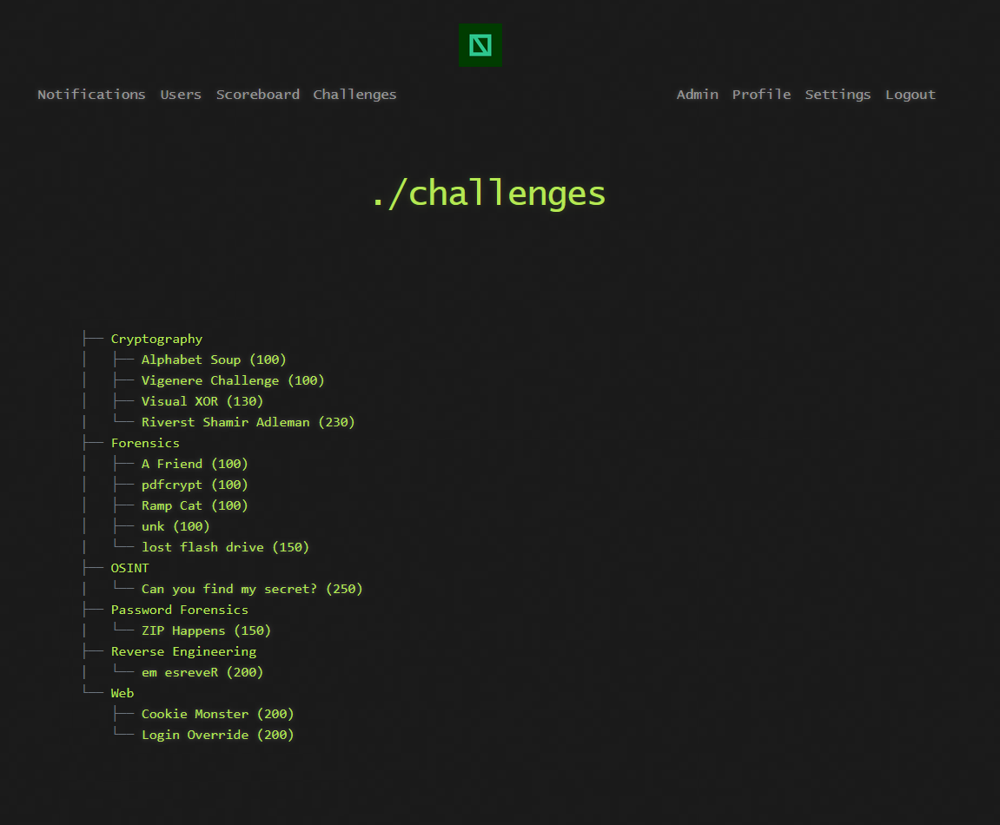
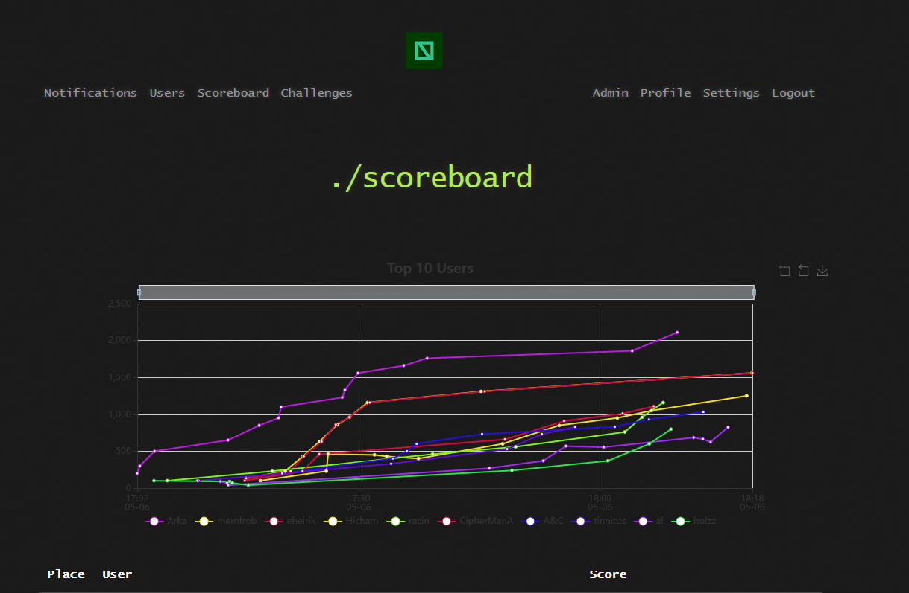

# 🌏 NITO CTF 2025 – Capture The Flag

Velkommen til NITOs Capture The Flag (CTF) repository! Dette prosjektet inneholder oppgavene og writeups fra det aller første digitale CTF-eventet arrangert av NITOs fagnettverk for Cybersikkerhet.

Arrangementet ble avholdt 6. mai 2025, og markerer starten på et nytt initiativ i regi av NITO der CTF og praktisk cybersikkerhet står i fokus.

## 🏆 Om CTF-en
CTF-en ble gjennomført digitalt med oppgaver i kategoriene:

* Cryptography
* Reverse Engineering
* Web Exploitation
* Password Cracking
* OSINT
* Forensics

## 📅 Arrangementet

CTF-en ble arrangert som en digital webinar, og deltakerne fikk tilgang til:

* En CTF-plattform (Hosted CTFd)
* Live scoreboards og konkurranseoppsett
* Veiledning, notifications og chat via Discord

> Fokus lå på lavterskel, praktisk læring og samarbeid, med en kombinasjon av enkle og mellomnivå oppgaver.

## 📂 Innhold i dette repoet

* `challenges/` inneholder undermapper for hver oppgave med:

  * Oppgavetekst (`challenge.md`)
  * Løsningsforslag (`writeup.md` eller writeup)
  * Tilhørende filer (krypterte zip, binærfiler, bilder osv.)
* `assets/` inneholder bilder brukt i writeups og presentasjoner

## 📈 Eksempler fra plattformen

### Oppgaveoversikt

### Scoreboard i sanntid

## 🌐 Mer info

NITOs fagnettverk for Cybersikkerhet jobber for å fremme cybersikkerhet og digital kompetanse blant medlemmene. Vi ønsker å skape et fellesskap der medlemmer kan lære, dele erfaringer og utvikle ferdigheter innen cybersikkerhet.

Bli med i [fagnettverket](https://www.nito.no/fagmiljo/fagnettverk-cybersikkerhet/) og hold deg oppdatert på kommende arrangementer, webinar og ressurser. 

[Plattformen](https://nettverk.nito.no/topics) er åpen for alle medlemmer, og vi oppfordrer alle til å delta aktivt

Se mer på [nito.no](https://www.nito.no) for mer informasjon om NITO og våre aktiviteter.

👥 Takk til alle som deltok og bidro – vi sees neste gang!

> "Hack with purpose. Learn by doing."
