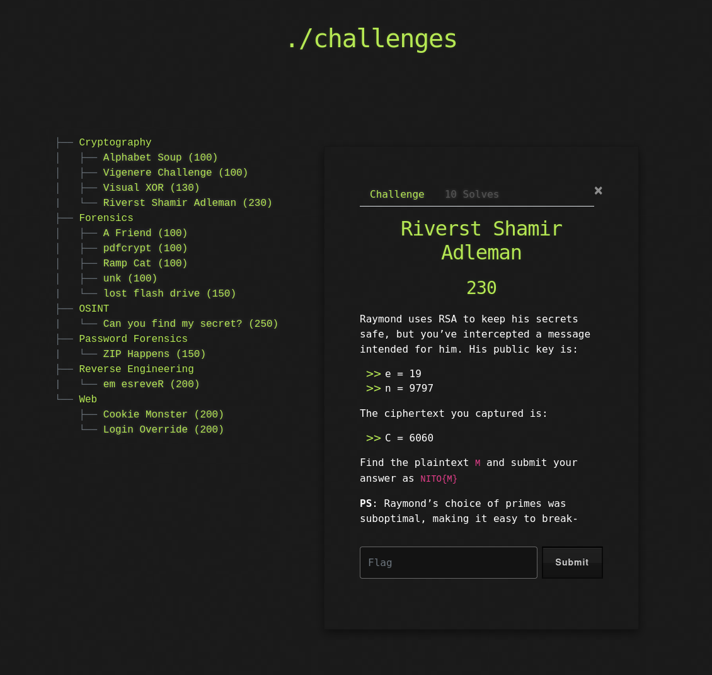

# 🔐 Challenge: Riverst Shamir Adleman

**Kategori:** Cryptography
**Poeng:** 230

Du har snappet opp en kryptert melding sendt til Raymond, som bruker RSA. Men noe virker svakt med tallene hans...

Du får:

```
e = 19
n = 9797
C = 6060
```

Klarer du å dekryptere meldingen og finne flagget?

Hint: Det er mulig å faktorisere `n`.

## 📝 Oppgavetekst



Flaggformat: `NITO{...}`
