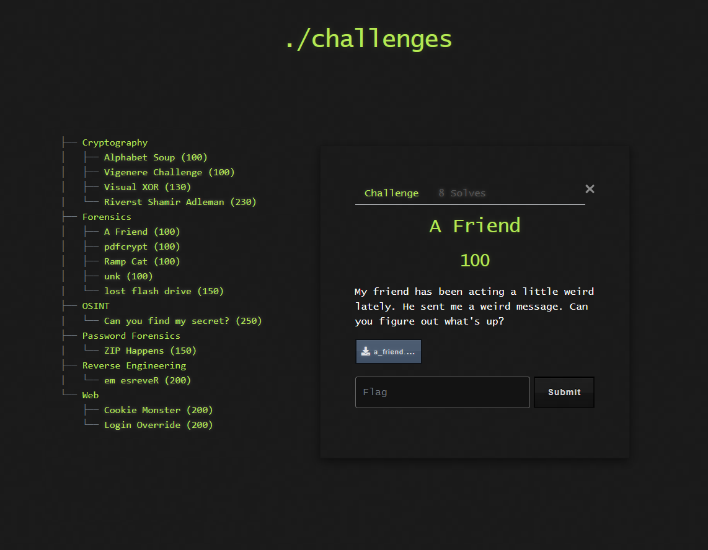

# 🧠 Challenge: A Friend

**Kategori:** Forensics
**Poeng:** 100

Vennen min har oppført seg litt merkelig i det siste. Han sendte meg en kryptisk melding – kan du finne ut hva som er galt?

💡 Hint

Sjekk metadata, filtype og encoding. Noen ganger gjemmer folk ting i det åpenbare.

## 📝 Oppgavetekst

## 📂 Fil 
* [a_friend.zip](a_friend.zip)

Flaggformat: `flag{...}`