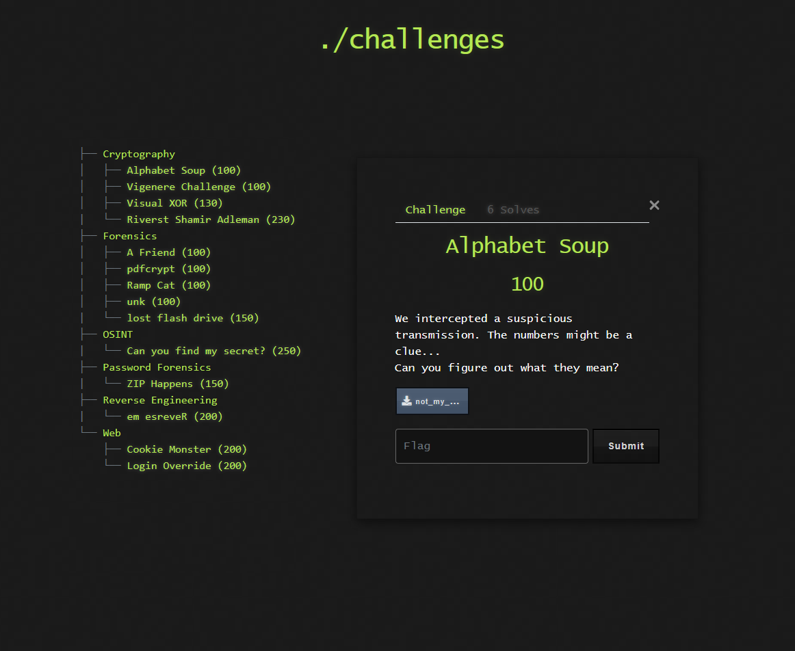

# 🔢 Challenge: Alphabet Soup

**Kategori:** Cryptography
**Poeng:** 100

Vi har fanget opp en mistenkelig transmisjon. Den består kun av tall, kanskje det er en ledetråd?

Kan du finne ut hva tallene egentlig betyr?

Hint: Kanskje hver verdi representerer en bokstav?

## 📝 Oppgavetekst

Flaggformat: `NITO{...}`
