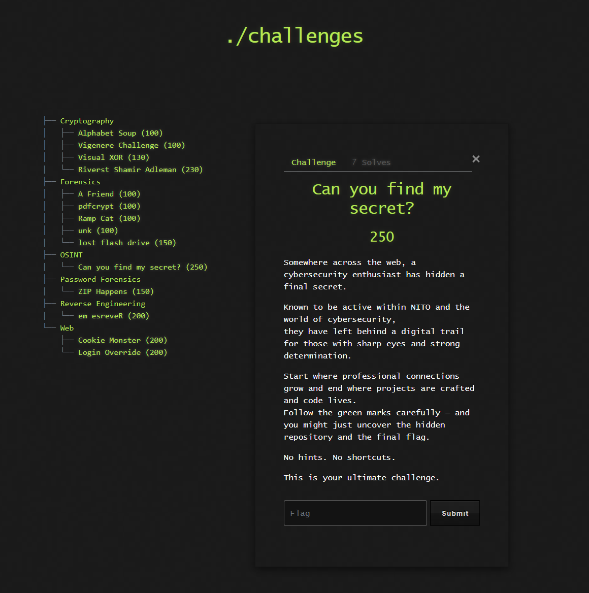

# 🌐 Challenge: Can you find my secret?

**Kategori:** OSINT
**Poeng:** 250

Somewhere across the web, a cybersecurity enthusiast has hidden a final secret.

Known to be active within NITO and the world of cybersecurity, they have left behind a digital trail for those with sharp eyes and strong determination.

Start where professional connections grow and end where projects are crafted and code lives.

Follow the green marks carefully – and you might just uncover the hidden repository and the final flag.

*No hints. No shortcuts.*

This is your ultimate challenge.

## 📝 Oppgavetekst

Flaggformat: `NITO{...}`

