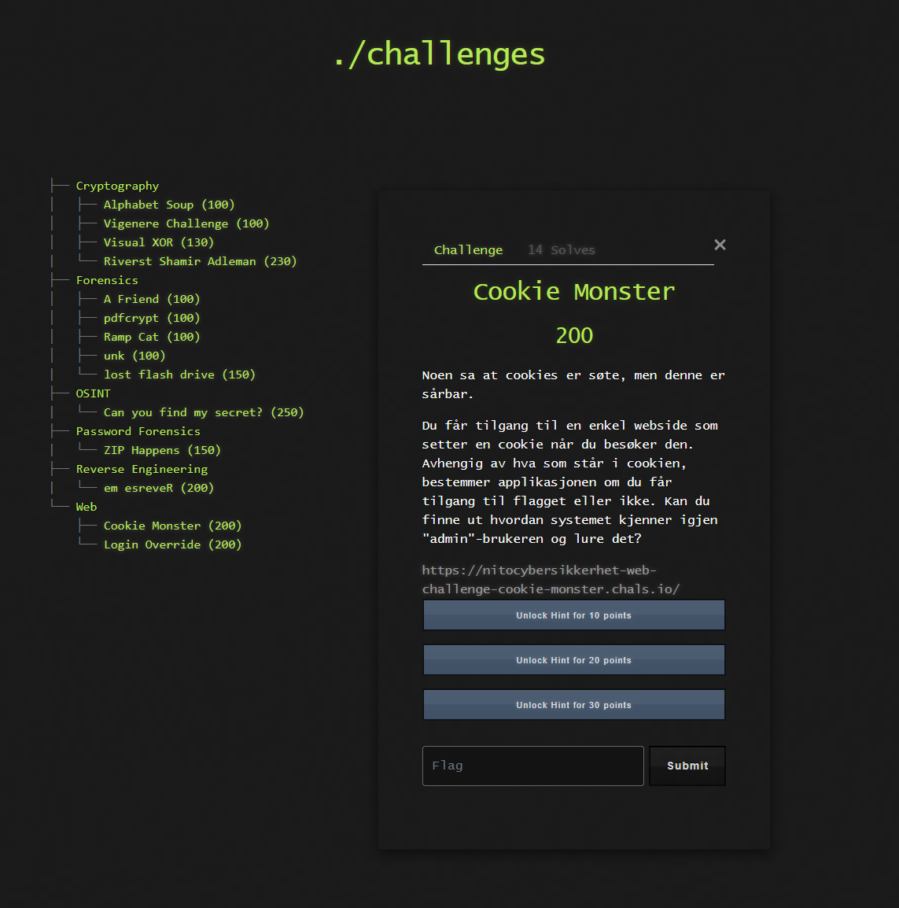

# 🍪 Challenge: Cookie Monster

**Kategori:** Web
**Poeng:** 200

Noen sa at cookies er søte, men denne er sårbar.

Du får tilgang til en enkel webside som setter en cookie når du besøker den. Avhengig av hva som står i cookien, bestemmer applikasjonen om du får tilgang til flagget eller ikke. Kan du finne ut hvordan systemet kjenner igjen "admin"-brukeren og lure det?

Hva slags verdi er `Z3Vlc3Q=`? Ser det kjent ut?

Hvis du dekoder `Z3Vlc3Q=`, hva får du da?

Hva skjer hvis du setter en ny cookieverdi for "`admin`"?

## 📝 Oppgavetekst

Lenke: [nettside](https://nitocybersikkerhet-web-challenge-cookie-monster.chals.io/)

Flaggformat: `NITO{...}`
