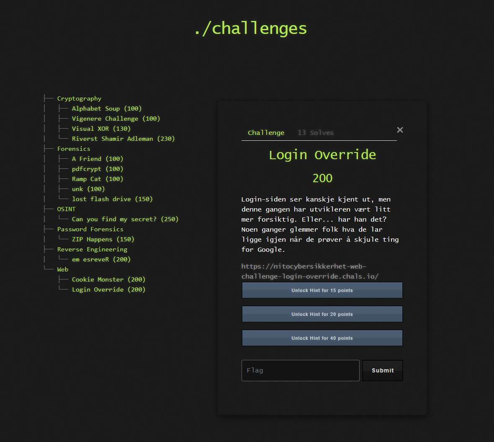

# 🔐 Challenge: Login Override

**Kategori:** Web
**Poeng:** 200

Login-siden ser kanskje kjent ut, men denne gangen har utvikleren vært litt mer forsiktig. Eller... har han det? Noen ganger glemmer folk hva de lar ligge igjen når de prøver å skjule ting for Google.

💡 Hint 1 (15 poeng)

Har du sjekket robots.txt for skjulte stier?

💡 Hint 2 (20 poeng)

Kanskje det ligger en hash i en sti du ikke ser med det blotte øyet?

💡 Hint 3 (40 poeng)

Crack hashen med enten John the Ripper, Hashcat eller annet verktøy ved å bruke wordlist.txt

## 📝 Oppgavetekst

Lenke: [nettside](https://nitocybersikkerhet-web-challenge-login-override.chals.io/)

Flaggformat: `NITO{...}`
