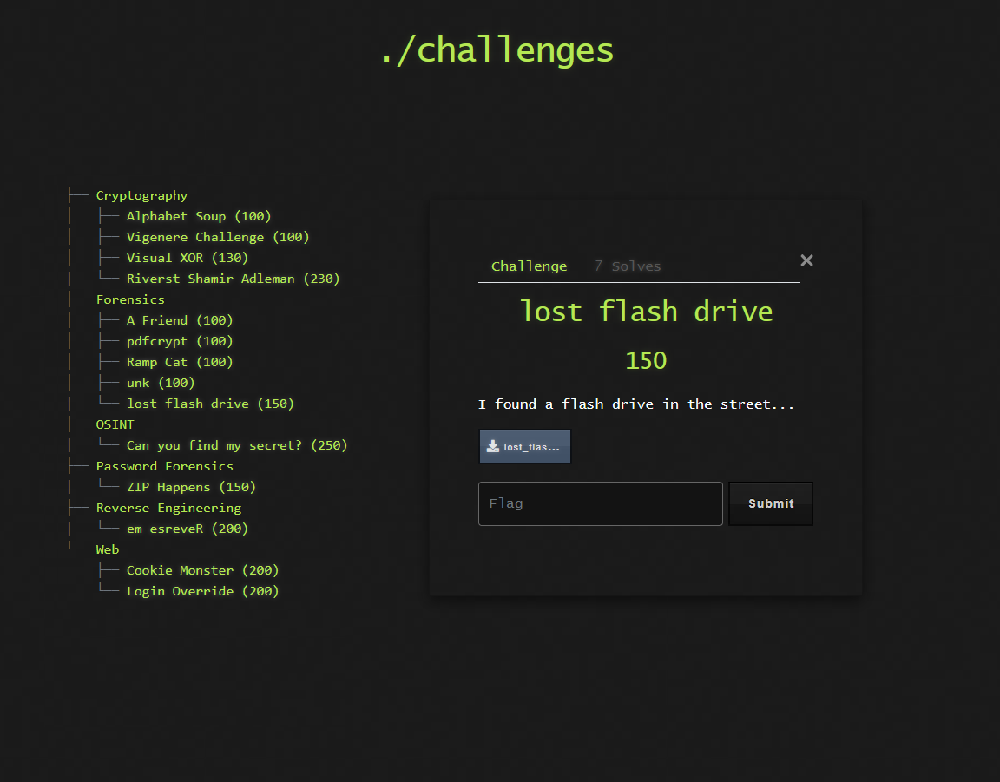

# 💾 Challenge: Lost Flash Drive

**Kategori:** Forensics
**Poeng:** 150

Jeg fant en USB-pinne i gata... Hva skjuler den egentlig?

💡 Hint

Du må kanskje mounte bildet eller analysere det med verktøy som `binwalk`, `testdisk` eller `foremost`.

## 📝 Oppgavetekst

## 🗃️ Fil
* [Last ned bilde](lost_flash_drive.zip)

Flaggformat: `flag{...}`
