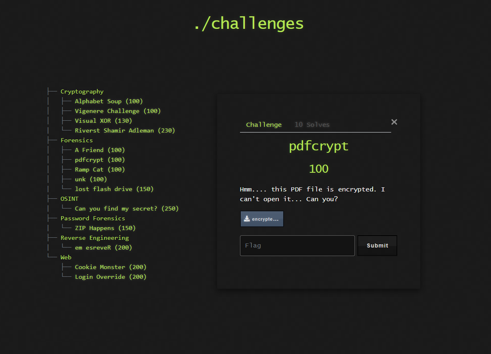

# 📄 Challenge: pdfcrypt

**Kategori:** Forensics
**Poeng:** 100

Hmm... denne PDF-filen er kryptert. Jeg får den ikke opp – kan du?

💡 Hint

Se etter verktøy som `pdfcrack`, `qpdf` eller bruk `john` til å brute-force passordet dersom du klarer å trekke ut hash.

## 📝 Oppgavetekst

## 📂 Fil

* [encrypted-1.pdf](encrypted-1.pdf)

Flaggformat: `flag{...}`

