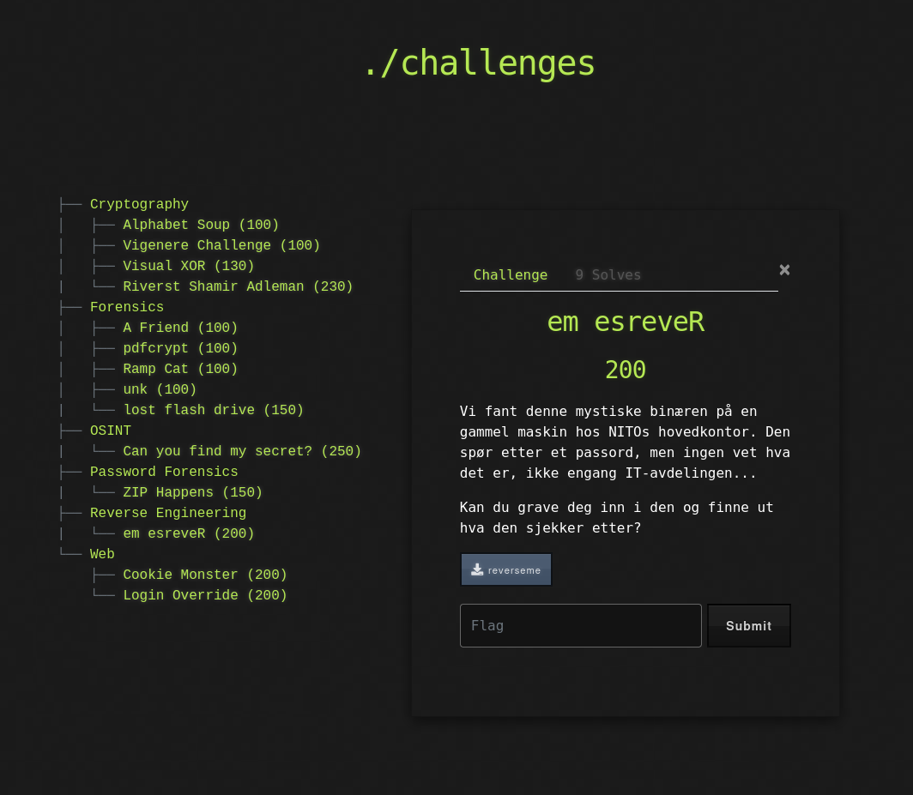

# 🧩 Challenge: Reverse Me

**Kategori:** Reverse Engineering
**Poeng:** 200

Vi har fått tak i en binærfil som tydeligvis sjekker et passord. Kan du finne ut hva den egentlig leter etter?

Hint: Dette er en klassisk reverse engineering-oppgave. Bruk verktøy som `strings`, `radare2` eller `Ghidra` for å inspisere binæren.

## 📝 Oppgavetekst

Last ned binæren, undersøk hva som skjer i programmet, og finn riktig passord for å få flagget!

Flaggformat: `NITO{...}`
## 📂 Fil

* [reverseme](ReverseMe/reverseme)