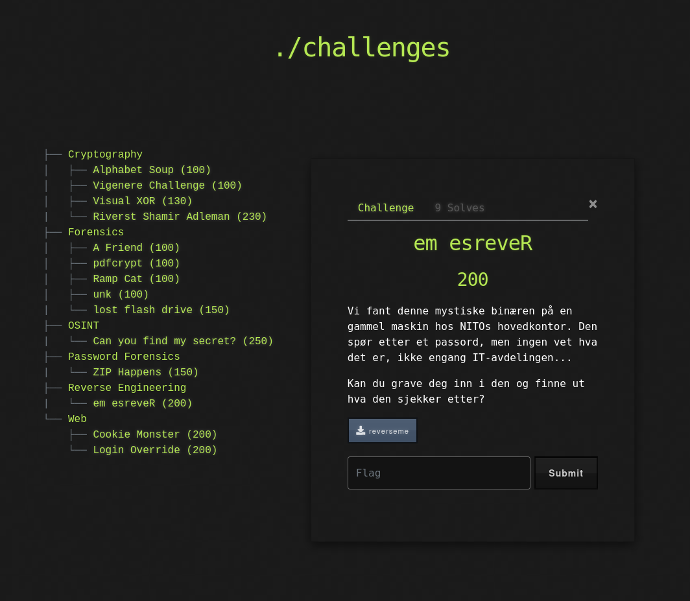
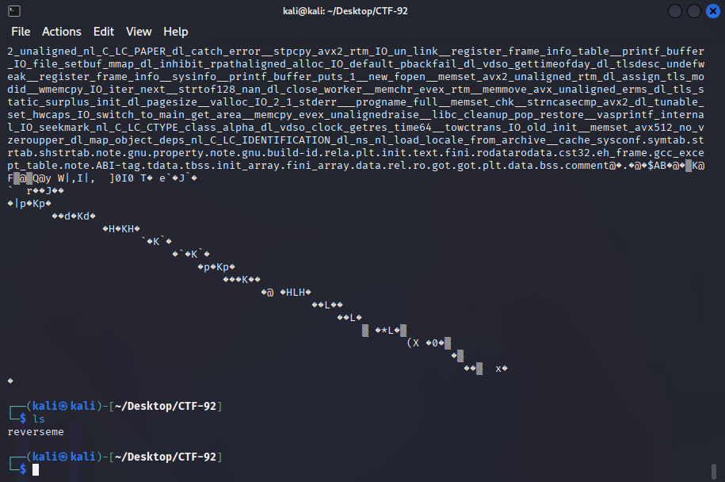
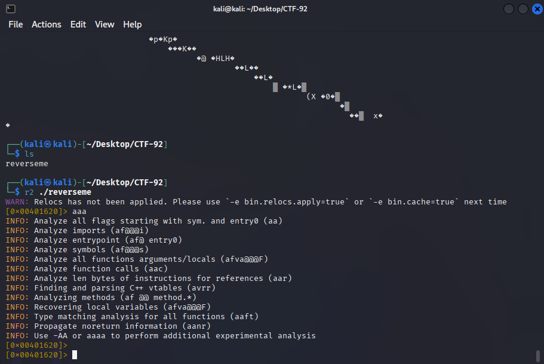
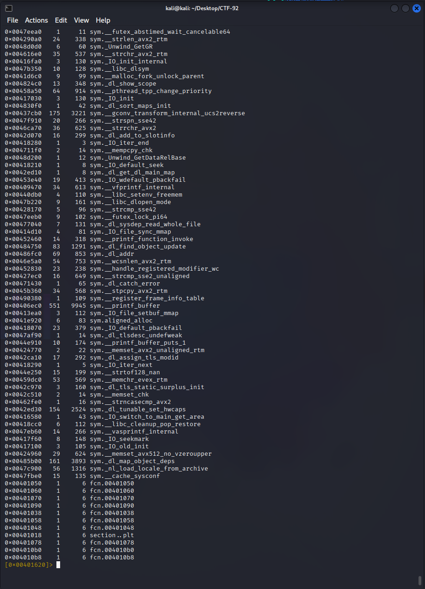
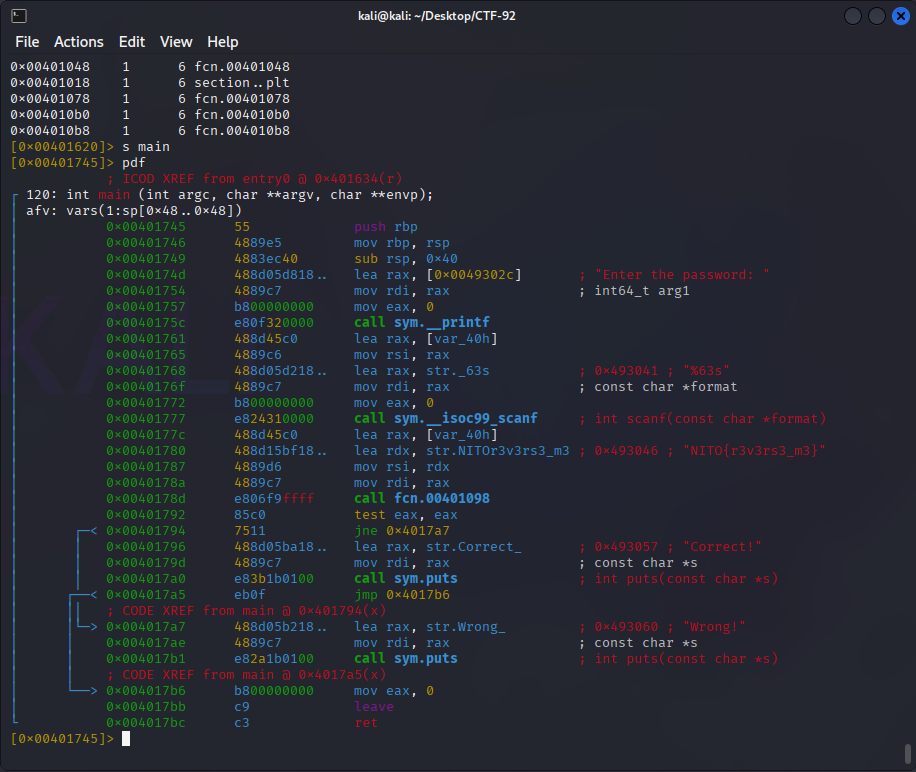

# 🔍 Reverse Engineering – Writeup: `em esreveR`

**Kategori:** Reverse Engineering
**Poeng:** 200

Vi fikk en mystisk binærfil som ber om et passord. Målet er å finne ut hva filen sjekker etter – og dermed finne flagget.

---

## 🖥️ 1. Oppgavetekst og fil

Vi starter med å laste ned binæren og se hva som skjer når vi prøver å kjøre den.



---

## 🗃️ 2. Kjapp test og binær sjekk

Vi prøver å kjøre programmet og ser at det forventer input:



Men å åpne den direkte med `cat` viser bare rot – dette er som forventet for binære filer.

---

## ⚙️ 3. Analyse med Radare2

Vi åpner binæren i `r2` og analyserer den med:

```bash
r2 ./reverseme
aaa
```



---

## 🔍 4. Finn funksjoner og hopp til `main`

Vi viser funksjoner med:

```bash
afl
```



Deretter hopper vi til `main` og bruker:

```bash
s main
pdf
```

---

## 📖 5. Se på main()



Her ser vi at programmet bruker `scanf` for å lese inn input, og sammenligner det med en hardkodet streng:

```c
strcmp(input, "NITO{r3v3rs3_m3}")
```

---

## ✅ Flagget

**NITO{r3v3rs3\_m3}**

Oppgaven løses ved å inspisere `main()` og identifisere strengen binæren sjekker input mot.

---
