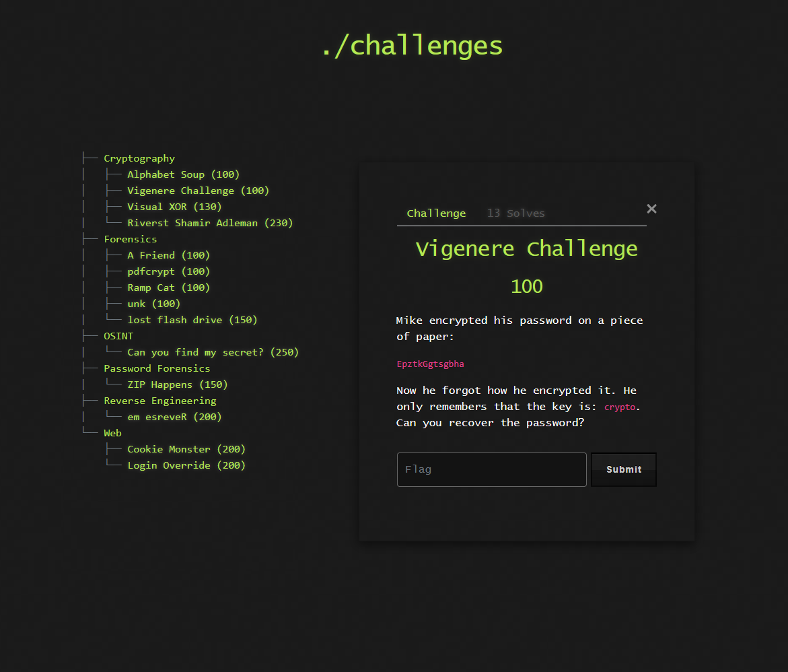

# 🔐 Challenge: Vigenere Challenge

**Kategori:** Cryptography
**Poeng:** 100

Mike har skrevet ned passordet sitt, men har glemt hvordan han krypterte det. Det eneste han husker er at han brukte nøkkelen `crypto`.

Kan du dekryptere meldingen og finne flagget?

## 📝 Oppgavetekst



## 🔑 Kryptert melding

```plaintext
EpztkGgtsgbha
```

## 🔑 Nøkkel

```plaintext
crypto
```

<details>
<summary>💡 Hint</summary>

Dette er en klassisk Vigenère-challenge – prøv et Vigenère-dekrypteringsverktøy med kjent nøkkel.

</details>
