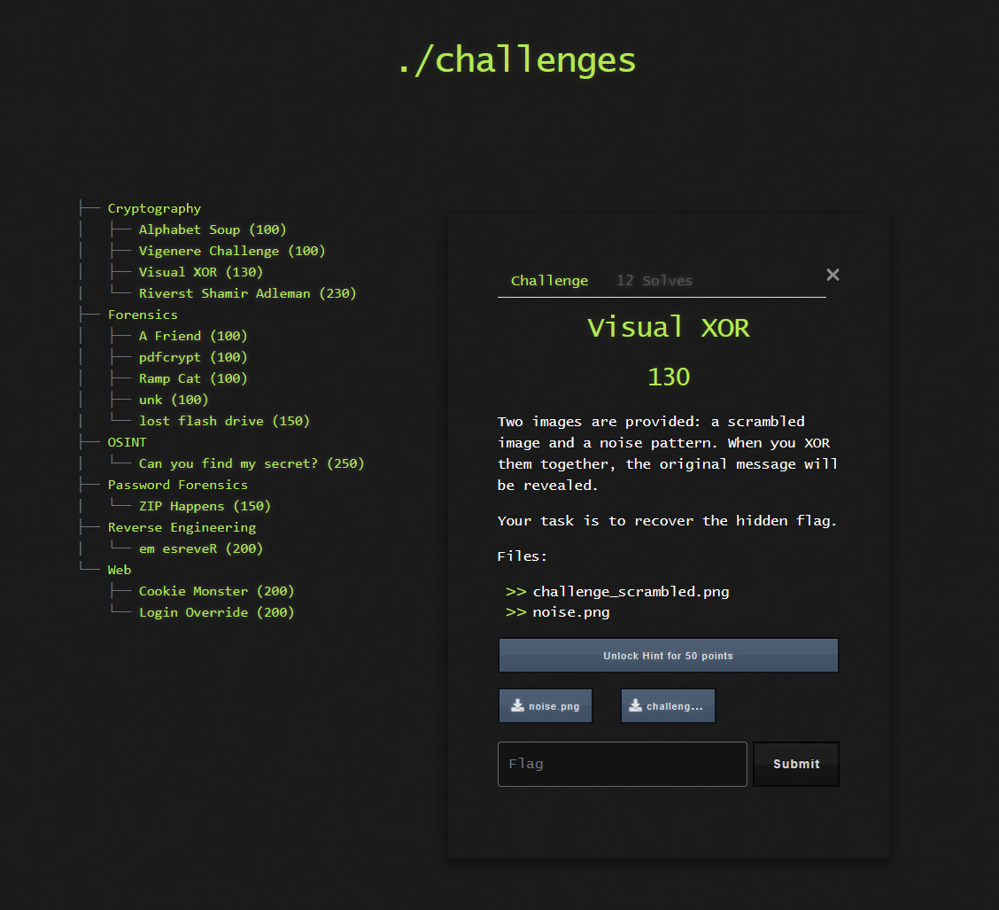

# 🖼️ Challenge: Visual XOR

**Kategori:** Cryptography
**Poeng:** 130

To bilder er gitt: et forvrengt bilde og et støybilde. Når du XOR-er dem sammen, skal det opprinnelige budskapet avdekkes.

Din oppgave er å rekonstruere det skjulte flagget.

💡 Hint

Use Python and `numpy` to XOR the images pixel-by-pixel.

## 📝 Oppgavetekst

Filene som følger med:

* [challenge_scrambled.png](challenge_scrambled.png)
* [noise.png](noise.png)

Flaggformat: `NITO{...}`

