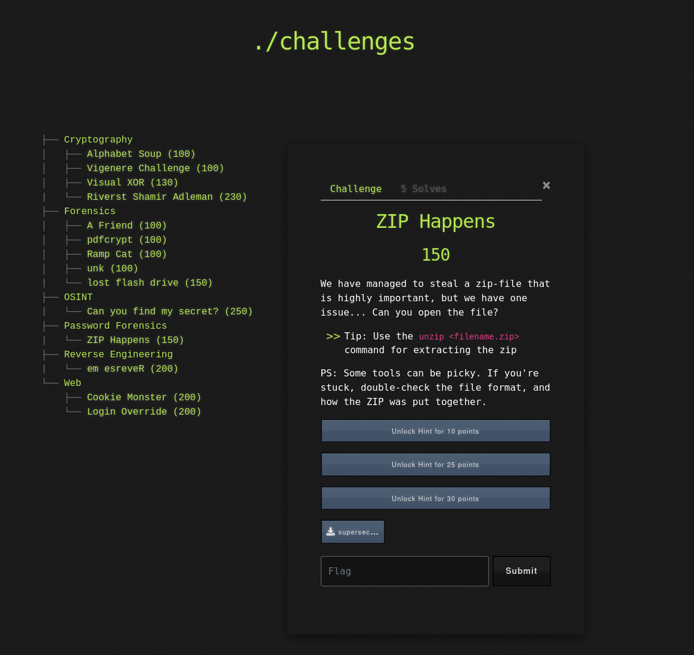
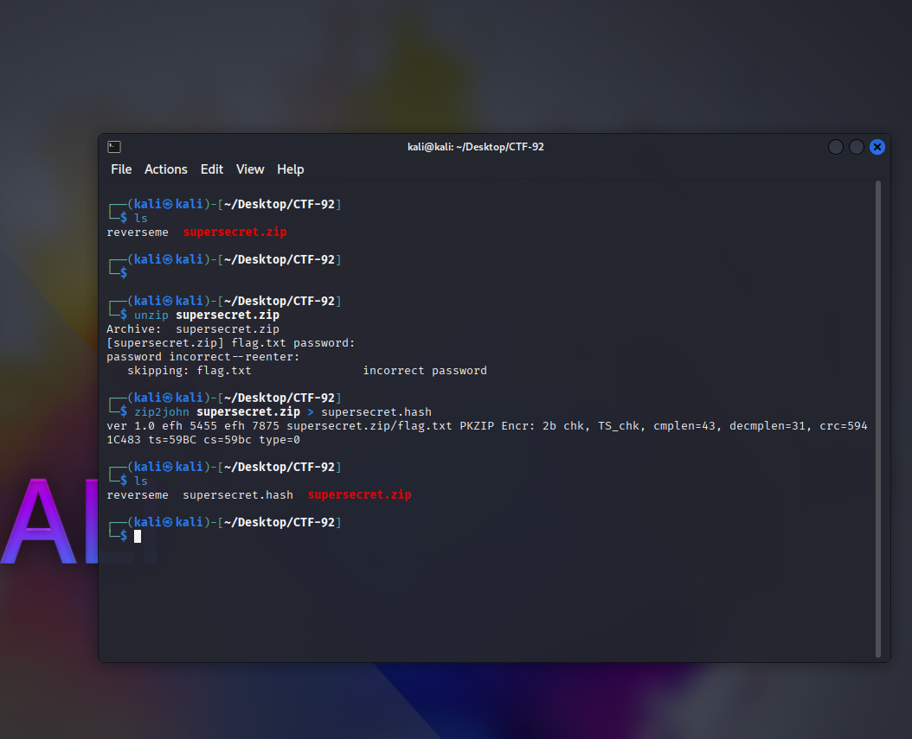
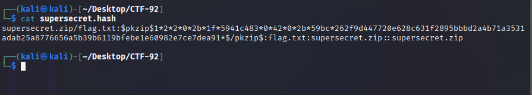
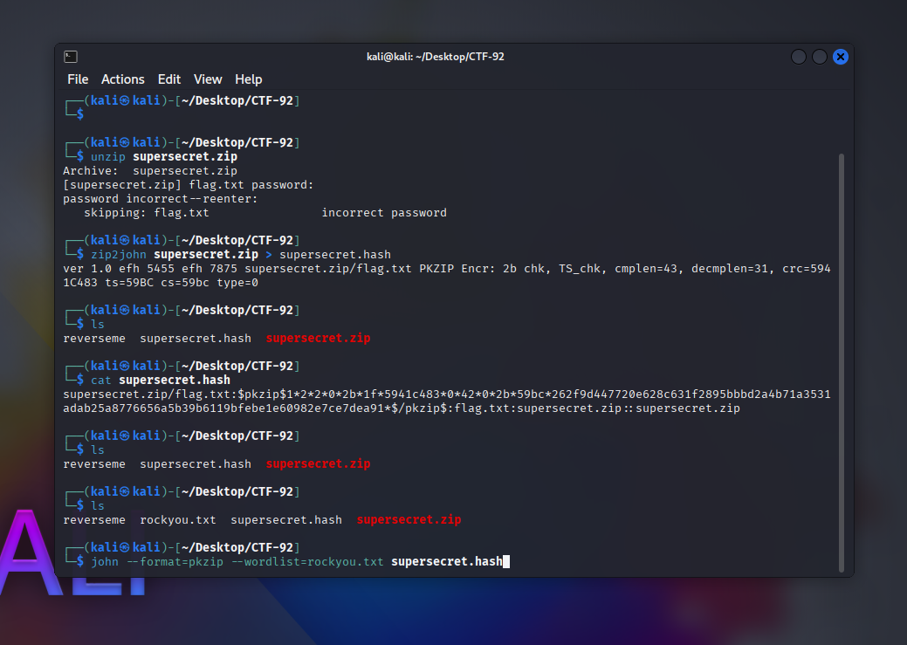
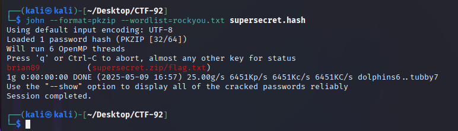
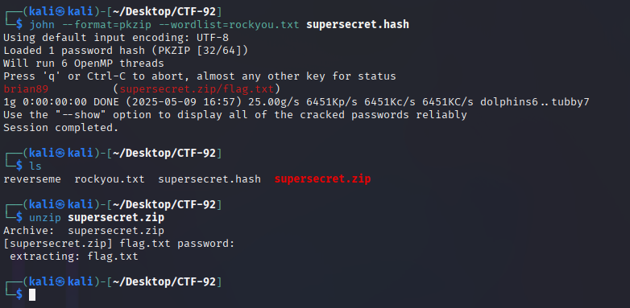
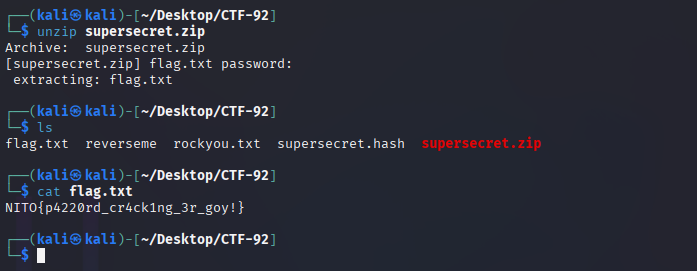

# 🔐 Password Forensics – Writeup: `ZIP Happens`

**Kategori:** Password Forensics
**Poeng:** 150

Vi har fått tak i en ZIP-fil med et ukjent passord. Kan du få tak i innholdet?

---

## 📁 1. Oppgavetekst og fil

Oppgaven antyder at man skal bruke `unzip`, men at noen verktøy kan være "picky".



---

## 📥 2. Første forsøk på å pakke ut filen

Vi prøver å pakke ut `supersecret.zip`, men må skrive inn et passord.



---

## 🔍 3. Ekstraher hash med `zip2john`

For å kunne brute-force passordet, bruker vi `zip2john` til å hente ut en hash.

```bash
zip2john supersecret.zip > supersecret.hash
```



---

## 🔎 4. Undersøk hashen

Vi kan kikke på innholdet i `.hash`-fila for å se at det ble korrekt generert.

```bash
cat supersecret.hash
```



---

## 🔧 5. Crack med John the Ripper

Vi bruker wordlisten `rockyou.txt` og spesifiserer formatet `pkzip`:

```bash
john --format=pkzip --wordlist=rockyou.txt supersecret.hash
```



John finner passordet: `brian89`

---

## 📂 6. Pakk ut med riktig passord

Nå som vi kjenner passordet, bruker vi `unzip` igjen:

```bash
unzip supersecret.zip
```



---

## 📄 7. Les flagget

Til slutt kan vi lese innholdet i `flag.txt`:

```bash
cat flag.txt
```



Flagget er:

**NITO{p4220rd\_cr4ck1ng\_3r\_goy!}**

---
